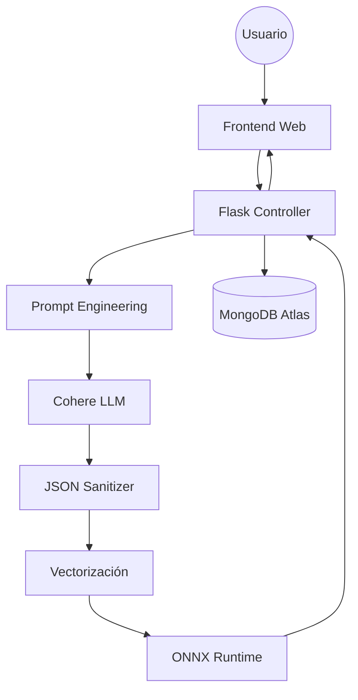

# 🛡️ PhishingPredictor™

<p align="center">
  <a href="https://github.com/tu-usuario/phishing-predictor">
    
  </a>
</p>

<p align="center">
  <strong>Plataforma de Ciberdefensa Activa basada en Inteligencia Artificial Híbrida</strong><br/>
  <em>"Donde la Semántica del LLM encuentra la Precisión del Machine Learning"</em>
</p>

<p align="center">
  
  
  
  
  
</p>

<p align="center">
  
  
  
</p>

<p align="center">
  <a href="#-introducción">Introducción</a> •
  <a href="#-arquitectura-técnica">Arquitectura</a> •
  <a href="#-características-del-sistema">Características</a> •
  <a href="#-instalación-y-despliegue">Instalación</a> •
  <a href="#-guía-de-uso">Uso</a> •
  <a href="#-roadmap">Roadmap</a> •
  <a href="#-faq">FAQ</a>
</p>

---

## 🚀 Introducción

**PhishingPredictor** representa un cambio de paradigma en la detección de amenazas digitales. Mientras que los antivirus tradicionales se basan en firmas estáticas y listas negras, esta plataforma adopta un enfoque **proactivo, contextual y explicativo**.

La solución implementa una **arquitectura híbrida** compuesta por dos sistemas de inteligencia artificial complementarios:

1. **Cerebro Cualitativo (LLM – Cohere):** análisis semántico, detección de ingeniería social, urgencia psicológica y contexto lingüístico.
2. **Cerebro Cuantitativo (ML – ONNX):** análisis matemático de características técnicas con modelos optimizados para inferencia rápida.

### 🆚 Comparativa de Enfoques

| Característica    | Antivirus Tradicional 🚫 | PhishingPredictor ✅    |
| ----------------- | ------------------------ | ---------------------- |
| Detección         | Reactiva                 | Proactiva y contextual |
| Tecnología        | Listas negras            | IA Híbrida (NLP + ML)  |
| Ingeniería social | No analizada             | Comprensión semántica  |
| Zero-Day          | No                       | Sí                     |
| Resultado         | Binario                  | Explicativo            |

---

## 🏛️ Arquitectura Técnica

PhishingPredictor se organiza como un **pipeline modular**, garantizando escalabilidad, resiliencia y trazabilidad.

### 🔄 Pipeline de Procesamiento



### 🧠 Componentes Clave

* **Agente de Extracción:** utiliza `command-r` de Cohere para extraer características técnicas del dataset UCI Phishing.
* **Motor de Inferencia:** modelos ONNX optimizados (URL y Texto).
* **Sistema de Resiliencia:** limpieza de JSON, validación de tipos y fallback automático.

---

## ✨ Características del Sistema

### 🌐 Deep URL Scanner

* Ofuscación de URLs
* Infraestructura y certificados SSL
* Análisis de contenido HTML

### 💬 Smishing & Email Analysis

* Urgencia psicológica
* Autoridad falsa
* Ofertas fraudulentas

### 👁️ Vision Guard (OCR)

* Análisis de capturas de pantalla
* Detección de suplantación visual

### 📊 Dashboard Analítico

* Mapas de calor
* Estadísticas dinámicas

---

## 📂 Estructura del Proyecto

```text
phishing-predictor/
├── static/
├── templates/
├── models/
├── .env
├── app.py
├── requirements.txt
└── README.md
```

---

## 🛠️ Instalación y Despliegue

### Prerrequisitos

* Python 3.9+
* MongoDB Atlas
* API Key de Cohere

### Clonar repositorio

```bash
git clone https://github.com/TU_USUARIO/phishing-predictor.git
cd phishing-predictor
```

### Entorno virtual

```bash
python -m venv venv
source venv/bin/activate  # Linux/macOS
venv\\Scripts\\activate     # Windows
```

### Instalar dependencias

```bash
pip install -r requirements.txt
```

### Variables de entorno (.env)

```ini
MONGO_USERNAME=tu_usuario
PASSWORD=tu_contraseña
COHERE_API_KEY=tu_api_key
```

### Ejecutar

```bash
python app.py
```

Accede a: [http://localhost:5000](http://localhost:5000)

---

## 🗺️ Roadmap

* [x] MVP Core Híbrido
* [ ] Extensión de navegador
* [ ] API Pública
* [ ] App móvil
* [ ] MLOps y reentrenamiento automático

---

## ❓ FAQ

**¿Por qué usar dos IAs?**
Porque combinamos comprensión semántica con velocidad matemática.

**¿Se almacenan datos personales?**
No, solo datos anónimos para estadísticas.

**¿Qué pasa con los falsos positivos?**
Pueden reportarse para mejorar el modelo.

---

## 👥 Equipo de Desarrollo

| Miembro          | Rol               | Especialidad    |
| ---------------- | ----------------- | --------------- |
| Javier Hernández | Full Stack Lead   | Flask, Web      |
| Kareem Barghouti | AI Engineer       | NLP, Cohere     |
| Ashley Harris    | Data Scientist    | ONNX, Analytics |
| Paco Perelló     | Backend Architect | MongoDB, DevOps |

---

## 📄 Licencia

Este proyecto está bajo licencia **MIT**.

<p align="center"><sub>Proyecto educativo – 2026</sub></p>
